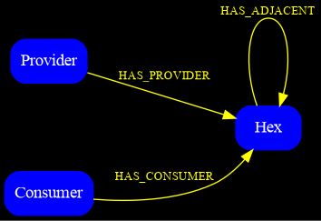

# Analyize the Panama Papers with Spanner Graph

This is a demo on how to query the Panama Papers





## Setup Gcloud 

```bash
gcloud auth application-default login
make instancecreate
make loadschema
```


## Get Python setup and load the Data

```bash
python3 -m venv .venv
source .venv/bin/activate
pip install -r requirements.txt
./load_data.py
```

## Run the Webapp

```bash
./app.py
```

## Start Queryring

[Queries](./SampleQueries.md)

## Running Raw Queries

